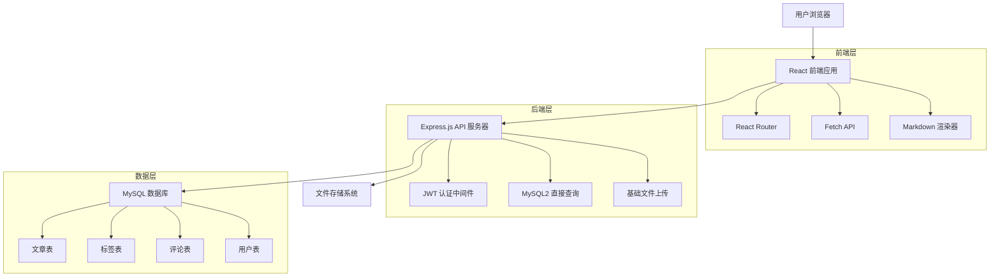
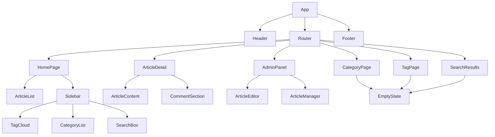

# 个人博客系统设计文档

## 概述

个人博客系统采用前后端分离的架构设计，前端使用 React 18 构建单页应用，后端使用 Node.js + Express.js 提供 RESTful API 服务，数据存储使用 MySQL 数据库。系统设计注重简洁性和可维护性，提供完整的博客功能包括文章管理、分类标签、搜索和评论系统。

## 架构

### 整体架构



### 技术栈

**前端技术栈**
- React 18 (基础函数组件)
- React Router (页面路由)
- fetch API (HTTP 请求，不用额外库)
- 普通 CSS 文件 (简单样式)

**后端技术栈**
- Node.js (基础版本)
- Express.js (简单 Web 服务器)
- mysql2 (直接 SQL 查询，不用 ORM)
- MySQL (数据库)
- JWT (身份认证)
- 基础文件上传 (不用 Multer)

## 组件和接口

### 前端组件架构



**核心组件说明**
- **App**: 主组件，包含路由
- **Header**: 顶部导航，有搜索框
- **ArticleList**: 文章列表，简单分页
- **ArticleDetail**: 文章详情页
- **CommentSection**: 评论区域
- **AdminPanel**: 管理页面
- **TagCloud**: 标签显示
- **EmptyState**: 没有内容时显示的提示

### API 接口设计

**文章相关接口**
```
GET    /api/articles          # 获取文章列表（支持分页、分类、标签筛选）
GET    /api/articles/:id      # 获取单篇文章详情
POST   /api/articles          # 创建新文章（需认证）
PUT    /api/articles/:id      # 更新文章（需认证）
DELETE /api/articles/:id      # 删除文章（需认证）
POST   /api/articles/:id/view # 增加文章浏览次数
```

**分类和标签接口**
```
GET    /api/categories        # 获取所有分类
GET    /api/tags              # 获取所有标签
GET    /api/tags/cloud        # 获取标签云数据
POST   /api/tags              # 创建新标签（需认证）
```

**搜索接口**
```
GET    /api/search?q=keyword  # 全文搜索文章
```

**评论接口**
```
GET    /api/articles/:id/comments  # 获取文章评论
POST   /api/articles/:id/comments  # 添加评论
POST   /api/comments/:id/reply     # 回复评论
```

**认证接口**
```
POST   /api/auth/login        # 管理员登录
POST   /api/auth/refresh      # 刷新 JWT 令牌
```

**文件上传接口**
```
POST   /api/upload/image      # 上传图片（需认证）
```

## 数据模型

### 数据库表结构

**用户表 (users)**
```sql
CREATE TABLE users (
    id INT PRIMARY KEY AUTO_INCREMENT,
    username VARCHAR(50) UNIQUE NOT NULL,
    email VARCHAR(100) UNIQUE NOT NULL,
    password_hash VARCHAR(255) NOT NULL,
    created_at TIMESTAMP DEFAULT CURRENT_TIMESTAMP,
    updated_at TIMESTAMP DEFAULT CURRENT_TIMESTAMP ON UPDATE CURRENT_TIMESTAMP
);
```

**分类表 (categories)**
```sql
CREATE TABLE categories (
    id INT PRIMARY KEY AUTO_INCREMENT,
    name VARCHAR(50) UNIQUE NOT NULL,
    description TEXT,
    created_at TIMESTAMP DEFAULT CURRENT_TIMESTAMP
);
```

**文章表 (articles)**
```sql
CREATE TABLE articles (
    id INT PRIMARY KEY AUTO_INCREMENT,
    title VARCHAR(200) NOT NULL,
    content LONGTEXT NOT NULL,
    summary TEXT,
    author_id INT NOT NULL,
    category_id INT,
    view_count INT DEFAULT 0,
    created_at TIMESTAMP DEFAULT CURRENT_TIMESTAMP,
    updated_at TIMESTAMP DEFAULT CURRENT_TIMESTAMP ON UPDATE CURRENT_TIMESTAMP,
    FOREIGN KEY (author_id) REFERENCES users(id) ON DELETE CASCADE,
    FOREIGN KEY (category_id) REFERENCES categories(id) ON DELETE SET NULL,
    FULLTEXT(title, content)
);
```

**标签表 (tags)**
```sql
CREATE TABLE tags (
    id INT PRIMARY KEY AUTO_INCREMENT,
    name VARCHAR(50) UNIQUE NOT NULL,
    color VARCHAR(7) DEFAULT '#007bff',
    created_at TIMESTAMP DEFAULT CURRENT_TIMESTAMP
);
```

**文章标签关联表 (article_tags)**
```sql
CREATE TABLE article_tags (
    article_id INT,
    tag_id INT,
    PRIMARY KEY (article_id, tag_id),
    FOREIGN KEY (article_id) REFERENCES articles(id) ON DELETE CASCADE,
    FOREIGN KEY (tag_id) REFERENCES tags(id) ON DELETE CASCADE
);
```

**评论表 (comments)**
```sql
CREATE TABLE comments (
    id INT PRIMARY KEY AUTO_INCREMENT,
    article_id INT NOT NULL,
    parent_id INT DEFAULT NULL,
    nickname VARCHAR(50) NOT NULL,
    email VARCHAR(100) NOT NULL,
    content TEXT NOT NULL,
    created_at TIMESTAMP DEFAULT CURRENT_TIMESTAMP,
    FOREIGN KEY (article_id) REFERENCES articles(id) ON DELETE CASCADE,
    FOREIGN KEY (parent_id) REFERENCES comments(id) ON DELETE CASCADE
);
```

### 数据库操作

使用简单的 SQL 查询，不使用复杂的 ORM：

```javascript
// 基础数据库连接
const mysql = require('mysql2');
const db = mysql.createConnection({
    host: 'localhost',
    user: 'root',
    password: 'password',
    database: 'blog'
});

// 简单查询示例
db.query('SELECT * FROM articles ORDER BY created_at DESC', callback);
```

## 正确性属性

*属性是指在系统的所有有效执行中都应该保持为真的特征或行为——本质上是关于系统应该做什么的正式声明。属性作为人类可读规范和机器可验证正确性保证之间的桥梁。*

基于需求分析，以下是系统必须满足的核心正确性属性：

### 属性反思

在定义具体属性之前，我需要识别和消除冗余的属性：

- **文章排序和显示**: 属性 1 和属性 2 都涉及文章显示，但测试不同方面（排序 vs 内容展示）
- **输入验证**: 属性 5、属性 13、属性 16 都测试空输入验证，可以合并为通用输入验证属性
- **搜索功能**: 属性 11 和属性 12 测试搜索的不同方面，保持独立
- **评论系统**: 属性 17、属性 18、属性 20 测试评论的不同功能，保持独立
- **安全属性**: 属性 21、属性 25 都涉及安全防护，但针对不同攻击类型

经过反思，大部分属性提供独特的验证价值，仅需要合并输入验证相关的属性。

**属性 1: 文章时间排序**
*对于任何* 文章集合，首页显示的文章列表应当按创建时间倒序排列
**验证需求: 需求 1.1**

**属性 2: 文章内容展示**
*对于任何* 文章，点击标题后应当显示该文章的完整内容和正确的元数据
**验证需求: 需求 1.2**

**属性 3: Markdown 渲染一致性**
*对于任何* 有效的 Markdown 内容，渲染后的 HTML 应当正确表示原始 Markdown 的语义结构
**验证需求: 需求 1.3**

**属性 4: 浏览计数准确性**
*对于任何* 文章，每次访问应当使浏览次数精确增加 1
**验证需求: 需求 1.4**

**属性 5: 输入验证一致性**
*对于任何* 空或仅包含空白字符的输入，系统应当拒绝创建文章或评论
**验证需求: 需求 2.5, 5.3**

**属性 6: 文章创建完整性**
*对于任何* 有效的文章数据，创建后应当在数据库中存在且在前台可见
**验证需求: 需求 2.1**

**属性 7: 文章更新保持性**
*对于任何* 文章更新操作，内容应当被修改但创建时间应当保持不变
**验证需求: 需求 2.2**

**属性 8: 级联删除完整性**
*对于任何* 文章删除操作，该文章及其所有关联的评论和标签关系应当从数据库中完全移除
**验证需求: 需求 2.3**

**属性 9: 文件上传往返一致性**
*对于任何* 上传的图片文件，返回的 URL 应当能够访问到与原始文件内容相同的图片
**验证需求: 需求 2.4**

**属性 10: 分类筛选准确性**
*对于任何* 分类，该分类页面显示的文章应当且仅应当包含属于该分类的文章
**验证需求: 需求 3.1**

**属性 11: 标签筛选准确性**
*对于任何* 标签，该标签页面显示的文章应当且仅应当包含被分配了该标签的文章
**验证需求: 需求 3.2**

**属性 12: 标签关联完整性**
*对于任何* 被分配了多个标签的文章，文章详情页应当显示所有相关联的标签
**验证需求: 需求 3.3**

**属性 13: 标签云权重准确性**
*对于任何* 标签集合，标签云中每个标签的视觉权重应当与其在文章中的使用频率成正比
**验证需求: 需求 3.4**

**属性 14: 搜索结果准确性**
*对于任何* 搜索关键词，返回的文章应当且仅应当包含在标题或内容中包含该关键词的文章
**验证需求: 需求 4.1**

**属性 15: 搜索高亮一致性**
*对于任何* 搜索结果，显示的内容中应当正确高亮所有匹配的关键词实例
**验证需求: 需求 4.2**

**属性 16: 评论创建即时性**
*对于任何* 有效的评论数据，提交后应当立即在文章下方显示
**验证需求: 需求 5.1**

**属性 17: 评论层级关系**
*对于任何* 评论回复操作，回复应当正确关联到父评论并建立层级关系
**验证需求: 需求 5.2**

**属性 18: 评论时间排序**
*对于任何* 文章的评论集合，评论应当按创建时间顺序显示
**验证需求: 需求 5.4**

**属性 19: JWT 认证完整性**
*对于任何* 有效的登录凭证，系统应当生成有效的 JWT 令牌；对于无效凭证，应当拒绝认证
**验证需求: 需求 6.2**

**属性 20: 授权验证一致性**
*对于任何* 管理操作，只有携带有效 JWT 令牌的请求应当被允许执行
**验证需求: 需求 6.3**

**属性 21: XSS 防护一致性**
*对于任何* 包含潜在脚本代码的用户输入，系统应当正确转义以防止 XSS 攻击
**验证需求: 需求 6.5**

**属性 22: 分页触发准确性**
*对于任何* 超过 10 篇文章的列表，系统应当自动启用分页功能
**验证需求: 需求 7.2**

**属性 23: SEO 元标签完整性**
*对于任何* 生成的页面，应当包含适当的 title、description 和 keywords 元标签
**验证需求: 需求 7.4**

**属性 24: 空状态提示完整性**
*对于任何* 分类或标签页面，当该分类或标签下没有文章时，系统应当显示相应的提示信息
**验证需求: 需求 3.5**

## 错误处理

### 错误分类和处理策略

**客户端错误 (4xx)**
- 400 Bad Request: 请求参数验证失败
- 401 Unauthorized: JWT 令牌无效或过期
- 403 Forbidden: 权限不足
- 404 Not Found: 资源不存在
- 422 Unprocessable Entity: 业务逻辑验证失败

**服务器错误 (5xx)**
- 500 Internal Server Error: 未预期的服务器错误
- 502 Bad Gateway: 数据库连接失败
- 503 Service Unavailable: 服务暂时不可用

### 错误响应格式

```json
{
  "error": {
    "code": "VALIDATION_ERROR",
    "message": "用户友好的错误信息",
    "details": {
      "field": "具体的错误详情"
    },
    "timestamp": "2024-01-01T00:00:00Z"
  }
}
```

### 前端错误处理

- **网络错误**: 显示重试按钮和友好提示
- **认证错误**: 自动跳转到登录页面
- **验证错误**: 在表单字段旁显示具体错误信息
- **服务器错误**: 显示通用错误页面
- **空状态处理**: 当分类或标签下无文章时，显示 EmptyState 组件提供友好提示

### 简单设计策略

**基础响应式**
- 用简单的 CSS media query
- 手机上文章列表变成单列
- 图片设置 max-width: 100%

**基础优化**
- 简单的分页（上一页/下一页按钮）
- 图片懒加载用简单的 onScroll 事件
- 不做复杂的缓存，保持简单

## 测试策略

### 双重测试方法

系统采用单元测试和基于属性的测试相结合的综合测试策略：

**单元测试**
- 验证具体示例和边界情况
- 测试组件集成点
- 覆盖错误条件和异常处理
- 使用 Jest 和 React Testing Library

**基于属性的测试**
- 验证跨所有输入的通用属性
- 使用 fast-check 库进行 JavaScript 属性测试
- 每个属性测试运行最少 100 次迭代
- 每个基于属性的测试必须用注释明确引用设计文档中的正确性属性

**简单测试要求**
- 写一些基本的测试用例
- 测试主要功能是否正常工作
- 不需要复杂的属性测试
- 重点是功能能用就行

**测试覆盖范围**
- 单元测试处理具体错误和集成测试
- 属性测试验证通用正确性保证
- 两种方法结合提供全面覆盖：单元测试捕获具体错误，属性测试验证一般正确性

### 测试环境

**前端测试**
- 基础的 Jest 测试
- 简单的组件测试

**后端测试**
- 基础的 Jest 测试
- 简单的 API 测试

**手动测试**
- 浏览器中手动点击测试
- 简单的功能验证